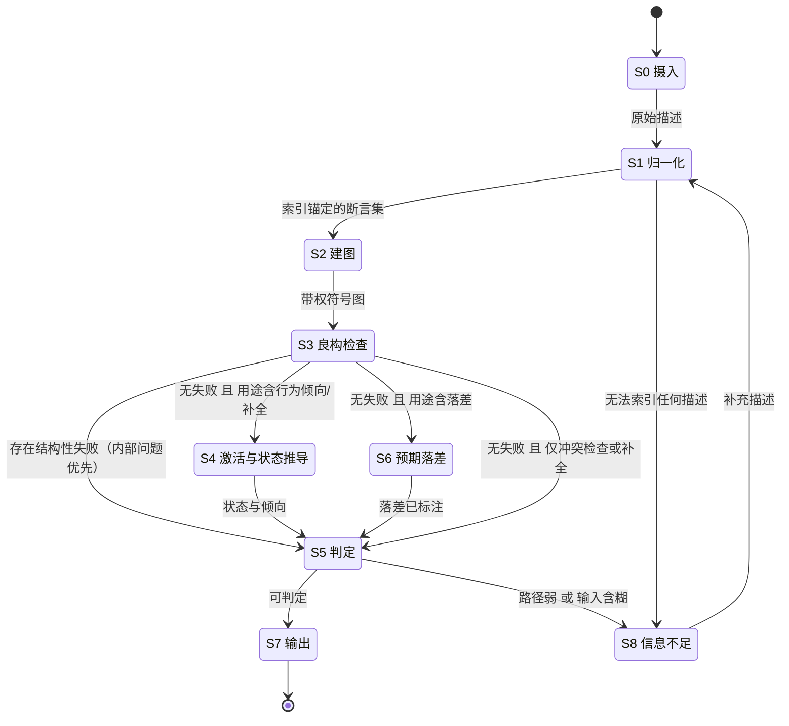
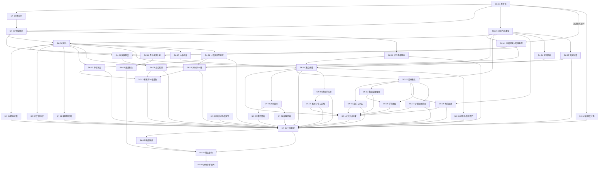

# 人物推导与一致性检查 SOP

版本 v1.8 · 2026-10-03（门㉖ 引文保真三值：EXACT 77 行锚词全中、UNVERIFIABLE 140 行抽样人核 10/10 忠实、2 处术语转写已修）；此前 v1.7 · 2026-09-28（E1–E11 全部实跑；含形式化审计 + **五轮真实测试沉淀** + **负标签换标签纪律**）
上游依据：438 条机制规则（`sources/mechanism_rule_ledger_2026-09-26.json`，逐字核验 438/438）

**本文件只含骨架**（控制流 + 判定契约）。可操作内容拆为 **41 个独立技能文件**，位于 `skills/`，按需载入；索引见第二部分。

---

# 第一部分 · 核心 SOP

## 0. 问题与契约

**核心问题**：给定随机格式的「已确立属性」，判定哪些其他属性、机制、行为倾向是**必然的、高度倾向的、情境依赖的、仅可能的、或与既有模型冲突的**，并检查跨情境、跨时间一致性。

| 项 | 内容 |
|---|---|
| **输入** | 任意格式的人物描述——散文、行为片段、原型标签、松散特质、完整档案 |
| **输出** | 带强度标注的判定集，每条可回溯到 `rule_id` 与图上路径 |
| **用途** | 三种，可单选可组合：**补全属性** ／ **行为倾向** ／ **冲突检查** |
| **不是** | 故事生成器。生成器产出文本；本 SOP 产出**判定** |

**前置条件（可验证）**（设计准则：前置须可验证）：

| 前置 | 验证方式 | 不满足时 |
|---|---|---|
| 输入非空 | `S0 → S1` 守卫 | 直接 S8 |
| **每条断言有 `rule_id` 或标 `anchor=external`／`internal_unanchored`** | 脚本检查 | 缺 `anchor` 的断言**不得进图**（否则污染 F1） |
| **一致性类型已声明**（§4.0） | 未声明则 §4.0 闸门不放行 | 阻止判定，不默认放行 |
| 承载侧**已确认走 `hybrid`**（§5.4） | 人工确认 | 不得自动裁决 `MANUAL` |

**完成判据（Exit，全部可验证）**（设计准则：判据须可观测、非「看起来对」）：

| 判据 | 检验 | 现状 |
|---|---|---|
| **E1** 每条输出判定带 `rule_id` 或图上路径 | 脚本 | ✅ 已实现 |
| **E2** 三值输出齐备（冲突／信息不足／无冲突），无第四值 | 脚本 | ✅ 已实现 |
| **E3** 五处验证门全过 | `python tools/verify_gates.py` 退出码 0 | ✅ 实跑通过 |
| **E4** 端到端 4 例 + S1 七格式全过 | `dryrun_e2e.py` ／ `s1_formats.py` 退出码 0 | ✅ 实跑通过 |
| **E5** 依据表引文逐字可核 | 200/200 | ✅ 实跑通过 |
| **E6** 台账摘录逐字可核 | 438/438 | ✅ 实跑通过 |
| **E7** S6 落差侧实跑 | `python tools/e7_gap.py` 退出码 0 | ✅ **10/10 通过** |
| **E8** S4 状态推导实跑 | `python tools/e8_state.py` 退出码 0 | ✅ **10/10 通过** |
| **E9** S8 回边实跑（含终止条件） | `python tools/e9_backedge.py` 退出码 0 | ✅ **11/11 通过** |
| **E10** 转移表形式化审计（soundness + 复杂度 + 四维质量） | `python tools/audit_formal.py` 退出码 0 | ✅ **全部通过** |
| **E11** 台账数字与文档一致（防陈旧统计） | `python tools/ledger_numbers.py --check` 退出码 0 | ✅ **通过** |

---

## 1. 三条不变量

**不变量一 · 输入格式随机 ⇒ 归一化是系统入口，不是预处理。**
下游无法假定「已确立属性」长什么样。归一化层必须把任意表述转成同一个中间物：**索引锚定的断言集**。

**不变量二 · 输出用途不定 ⇒ 一张图 + 三种读操作，不是三条管线。**
三种用途需要的中间量不同（可达性／激活分布／良构性），但共享同一张图。合并成一张转移表会让每种用途被另两种的假设污染；拆成三条管线则会三倍重复建图。

**不变量三 · 内部一致性优于预期落差，且两者分开计。**

| | 内部一致性 | 预期落差 |
|---|---|---|
| **判据位置** | **文本内** | **文本外**（读者先验图） |
| **地位** | 首要、绝对 | 参考标注，**不构成绝对冲突** |
| **输出** | 违例 + 待解释 | 落差值 + 标注 |
| **理由** | 判据完全在文本内 | 可**刻意**用于制造惊喜（P24-09） |

**分离不需要约定**：两者读**不同的图**，判据来源在系统边界的两侧。

---

## 2. 核心构件：一张带权有向符号图

### 2.1 三要素

| 要素 | 依据 | 内容 |
|---|---|---|
| **节点** | P20-03 | 认知情感单元（PCC）与情境线索 |
| **边** | P20-03；P01-04 | **带权**（连接强度）且**带符号**（正／负） |
| **节点属性** | P20-03 | 激活准备度 |

**行为发生 = 某节点激活越阈**（P20-02）。激活经边扩散（P20-05）。节点须保持激活达一定时长才进入状态（P20-04）。

### 2.2 边有符号，是判定的地基

P01-04 明确「单元间连接**强度与符号**的个体差异」。因此「符号相反」是**可判定的结构性质**，不是语义解释——这使冲突检测不必依赖主观判断。

### 2.3 稀疏性构造性满足

P01-03：单元间可能的关系很多，**但只有一部分在功能上重要**；推导系统不能把全部属性间关系都当作有效规则。

**实现含义**：边**只来自文本实际写出的关系**。不补全、不猜全连接。

**因此稀疏性不需要额外约束**——文本写出的关系相对「可能的关系空间」永远是极小比例。这同时回答了「输入随机怎么办」：**输入决定图的稠密度，系统如实反映它，不替输入补全。**

### 2.4 可验证算例（P20-06）

工作区唯一一份端到端算例，作为实现验收基准：

| 情境线索 | 激活的目标 PCC | 预测状态值 | 频率 |
|---|---|---|---|
| 与 Sarah 在家度过的周末夜晚 | 支持亲密 | 4–5 | ~60% |
| 朋友邀去酒吧；Sarah 一同前往 | 维持友谊 | 6–7 | ~15% |
| 朋友邀约但 Sarah 拒绝 | 目标冲突，留在家中 | 4 | ~25% |

TraitDES 均值 5.5，SD ≈ 1.4。**注意频率是分布而非单值**，且三条线索各只连一个目标 PCC——**没有多余连接**。

---

## 3. 主状态机



### 3.1 转移表

| 从 | 到 | 守卫 | 说明 |
|---|---|---|---|
| S0 | S1 | 输入非空 | |
| S1 | S2 | 断言集非空 | |
| S1 | **S8** | 某片段**无法索引任何描述** | 不猜，向输入侧要信息 |
| S2 | S3 | 图已建（节点＋边＋权＋符号） | |
| S3 | **S5** | 存在 F1／F2／F3 违例 | 内部问题优先，**终止下游**（S4／S6 皆不执行） |
| S3 | S4 | 无违例 **且** 用途含行为倾向／状态推导 | |
| S3 | S6 | 无违例 **且** 用途含落差 | 嵌套：一致性过了才计落差 |
| S3 | S5 | 无违例 **且** 仅冲突检查或补全 | 补全＝可达性查询，不需激活 |
| S4 | S5 | 状态推导完成 | 与 S6 为**并行分支**，可同时触发 |
| S6 | S5 | 落差已标注 | 与 S4 为**并行分支**，可同时触发 |
| S5 | S7 | 判定完整 | |
| S5 | **S8** | 路径弱 或 输入含糊 | |
| S8 | **S1** | 补充描述 | **唯一回边** |
| S7 | 终止 | | |

**唯一回边 S8 → S1 的含义**：系统在信息不足时**向输入侧要信息，而不是降低判定标准**。

**S5 → S8 的判据（E9 实跑校准，两条都是踩过坑才定对的）**：

| 判据 | 说明 |
|---|---|
| **收敛条件** | **存在至少一条完整可判定的断言**（有索引锚 **且** 有 `rule_id`）即可推进。**不是「所有断言都补齐」**——S8 补充的是**新描述**，不是修补**旧断言**；要求全集补全会让回边永不收敛。 |
| **残缺断言** | 不阻断推进，但**必须带入 S7 的受限标注**，**不得静默丢弃**（判据 A11）。残缺断言的输出**不得被当作已确立属性**。 |
| **不得作为回边触发条件** | ①`w is None`（**全局未标定量**，补不出）；②三值阈值 `f` 未标定（属 **MANUAL**，走人工不走去 S8）。 |

**回边终止条件见 §5.4**（补充轮上限 3、自应用深度上限 2）。

### 3.1.1 形式化审计（实跑）

按 Petri 网工作流的 soundness 三项 + 过程复杂度审计的三指标，对 §3.1 转移表做机器审计（**数字真源：`python tools/audit_formal.py`，不得手填**）：

| 审计项 | 结果 |
|---|---|
| **可达性** | 从 S0 可达 **9/9** 状态，无孤岛 ✅ |
| **option to complete** | 全部可达状态均可到达终态 ✅ |
| **死锁** | 无出边的非终态：**无** ✅ |
| **环** | **恰好 1 条**：`S1→S2→S3→S5→S8→S1`——即**唯一回边**，有界性由 §5.4 轮上限保证 ✅ |
| **Size** | places 9 ／ transitions 13 ／ tokens 22 |
| **Coupling** | 连通组件 **1**（无孤岛）；最大扇出 **S3 = 4** |
| **Cohesion** | tokens/arcs = **1.69**，每个状态都有明确去向 ✅ |

**S3 扇出 4 是唯一汇聚点 —— 经核为「嵌套分派」，不是复杂度缺陷**：

- **第一层**按「有无 F1／F2／F3 违例」划分：违例 → S5（截断下游）；无违例 → 按用途分派。**互斥** ✅
- **第二层**「用途含行为倾向／状态推导」与「用途含落差」**不互斥**——§0 声明用途「可单选可组合」。二者是 **AND-split／AND-join 并行分支**，**不是** XOR，故不构成守卫重叠 ✅
- **第三层**「仅冲突检查或补全」＝前两者都不含，覆盖完整 ✅

**S5 出现两次（守卫不同）是 XOR-merge，不是重复边**——违例路径与正常路径汇入同一判定状态，符合 `bpmn-soundness-explainer` 的 option-to-complete 要求。

### 3.2 各状态的执行内容

| 状态 | 执行 | 调用技能 |
|---|---|---|
| **S0 摄入** | 接收任意格式描述 | — |
| **S1 归一化** | 过程陈述 → 索引锚定的断言集；每条断言定认知内容类型 | SK-01 ／ SK-02 ／ SK-03 ／ SK-24 |
| **S2 建图** | 建节点与带权符号边；并列产出行为清单供交叉校对 | SK-04 ／ SK-05 ／ SK-06 ／ SK-07 ／ SK-08 ／ SK-32 |
| **S3 良构检查** | **一致性类型声明（闸门）** → 跑三类结构性失败 | **SK-38** ／ SK-09 ／ SK-10 ／ SK-11 ／ SK-12 ／ SK-13 |
| **S4 激活与状态推导** | ① 记忆检索与例外 → ② 扩散与越阈 → ③ 评价与情绪 → ④ 目标与意向 → ⑤ 手段选择 → ⑥ 行动生成与排序 → ⑦ 状态修正 | ① SK-31 ／ SK-30 ／ ② SK-14 ／ ③ SK-21 ／ SK-22 ／ SK-23 ／ ④ SK-25 ／ SK-26 ／ ⑤ SK-27 ／ SK-28 ／ SK-29 ／ ⑥ SK-33 ／ SK-34 ／ SK-35 ／ SK-15 ／ ⑦ SK-36 ／ SK-37 |
| **S5 判定** | 聚合判定，赋强度，写依据 | SK-16 ／ SK-17 |
| **S6 预期落差** | 与先验图比对 | SK-18 ／ SK-19 |
| **S7 输出** | 判定集 + 强度 + 依据 → 按视点组织 | SK-20 ／ **SK-40** |
| **S8 信息不足** | 请求补充描述（**转入条件由 S5 的 SK-16／SK-12 判定**） | — |

**补全属性＝可达性查询**，不依赖激活，可在建图后任意时刻执行，S5 聚合时输出。

---

## 4. 判定契约

### 4.0 一致性类型闸门（先于 4.1）

**任何一致性判定必须先声明所检类型。**「一致性」**不是单一标量**——有**五个彼此独立**的类型：

| 序 | 类型 | 支撑层 | 范围 |
|---|---|---|---|
| ① | 信念一致性 | beliefs | 跨情境 |
| ② | 目标一致性 | goals | 跨情境 |
| ③ | 评价标准一致性 | evaluative standards | 跨情境 |
| ④ | 跨系统功能互作一致性 | 功能性互作 | 系统内 |
| ⑤ | 现象学一致性 | 现象学层面 | 现象学 |

**执行者：SK-38。** 三条硬约束随本闸门生效：

1. **检查对象只能是「结构」，不能是「状态」**（P01-07）。**状态随情境变化是定义如此，不是不一致**——这是最常见的误报来源。
2. **判据是「行为变异模式的稳定性」，不是高一致性系数**（P01-05）。原文判定**追求更高的一致性系数「在方向上是错的」**。
3. **④⑤两类只能声明、不能判定**——材料只给名称与支撑层，**未给判据**。

## 4.1 三值输出

设 `X` 为一条功能断言，`In(X)` 为其入边集，每条入边带符号 σ（`+` 支持 X 的方向，`−` 相反）与权 `w`。

| 判定 | 图上判据 |
|---|---|
| **冲突** | `In(X)` 中存在 σ = `−` 的边，**且** 该边 `w` 足够强 **且** 未被情境折扣（SK-07／SK-10） |
| **信息不足** | 反向入边存在但 `w` 弱，**或** 已被情境折扣，**或** X 的来源文本含糊（SK-12） |
| **无冲突** | `In(X)` 全部 σ = `+`（含仅弱支撑）；**或** `In(X)` 为空但 X 是**维度陈述**而非功能断言（不主张功能，故不需要成因） |

**「反向入边弱 ⇒ 信息不足」而非「冲突」**，是本契约的关键：证据不足与证据相反是两件事。

**第二值不可省**：它挡住的正是「把读者自己的不确定报成人物的问题」。P44-08 已写明，**含糊输入是不一致性的主要成因**。

### 4.2 三类结构性失败（图上的失败模式）

| 失败 | 图上判据 | 现象 | 技能 |
|---|---|---|---|
| **F1 悬空** | 功能断言的**入边集为空** | 「没有缘由」——断言存在但无发展结构 | SK-09 |
| **F2 符号相反** | 入边存在但**符号与断言相反** | 文本给出的成因推出相反结论 | SK-10 |
| **F3 跨时无解释** | 同一节点跨时间取值变化，**无解释边** | P47-04：违例须有显式或隐式解释 | SK-11 |

**这三类覆盖图上的全部失败模式**：任何功能断言只能是无入边、入边符号冲突、或跨时间变化而无解释边。

**「张力」不是失败**——可达且符号不冲突即为正常（安静 + 爱运动）。**记录但不判错。**

**豁免**：P24-09——不一致可被**有意**用于制造异化、知觉扰乱、陌生化或解构。检查器须允许该类别，否则会惩罚解构型设计。

### 4.3 建图前置拦截（不属图的良构性）

| 拦截项 | 判据 | 依据 |
|---|---|---|
| **时间越界** | 引用时间戳 **T > T\*** 的节点 | P27-07 生成侧硬过滤 |

### 4.4 强度五档

| 强度 | 含义 |
|---|---|
| **必然** | 由输入直接蕴含，或经必然后果链条推出 |
| **高度倾向** | 强证据支持，但有反例空间 |
| **情境依赖** | 条件成立时成立；**条件本身是输出的一部分** |
| **仅可能** | 弱证据，不可排除 |
| **与既有模型冲突** | 与台账内某条 `necessary` 规则方向相反 |

**枚举沿用台账，不自行扩充。**

### 4.5 严重度的结构性来源

**不是数证据条数**，是三个独立量：

| 分量 | 依据 | 含义 |
|---|---|---|
| **入边强度** | P20-03 | 断言有多少支撑 |
| **路径长度／中间节点数** | 可达性 | 支撑有多间接 |
| **输入信息含糊度** | P44-08 | 断言本身是否模糊 |

三者中**含糊度必须单列**——否则会把「读者不确定」误报为「人物有问题」。

**分级**：轻微（张力）→ 记录不判错；严重（F1／F2／F3）→ 判为问题。

---

# 第二部分 · 技能索引

## 2.0 读法：依据分级与引号约定

技能是可执行的操作文档，其中**每一句规范性内容都必须能归入下列三级之一**。混级即是「编造」——把自建参数伪装成材料结论。

| 级 | 含义 | 纪律 |
|---|---|---|
| **【提取】** | 材料原文直接支持，附 `rule_id` | 引文必须逐字可核（`「」`内不得有隐式省略） |
| **【设计决定】** | 在材料基础上做的形式化选择——材料**未规定** | 不改判定，只改表达形式；改判据须同步改此段 |
| **【自建】** | 材料中**不存在**，必须自建并验证 | **不得冒充材料结论**；须在输出中随判定声明 |

**引号约定**：`「」` 用于**引述**（材料原文、输入原话、自撰术语的强调）。**区分不靠括号，靠这两条硬要求**：

1. **材料原文引文必须出现在该技能的「依据」表中，并附对应 `rule_id`**。不在依据表里的，一律不是材料引文。
2. **依据表中的引文必须逐字可核**——`「」` 内不得有隐式省略（省略处须写 `……`）。

> 本技能库现况：59 条材料引文，**逐字核验 58/58 命中**（另 1 条为释义，已改非引文格式）。

**判读依据时的顺序**：先看「依据分级」段（这条内容是提取、设计决定、还是自建），再按需下钻到「依据」表核对原文。

**技能文件的固定结构**：`何时用 · 输入输出 · 操作 · 依据 · 依据分级 · 边界与失效条件 · 自检`。**「依据分级」段是审计入口**——若要检查某个技能有没有编造，只读该段即可。


技能已拆为**独立文件**，位于 `skills/`。每个技能自带 frontmatter（`id` / `sop_state` / `trigger` / `depends_on` / `outputs_to`），可**按需单独载入**。

## 载入规则

| 情形 | 载入 |
|---|---|
| 执行到某状态 | 只载入该状态列出的技能 |
| 技能间有 `depends_on` | 先载其依赖 |
| 修复／加深某技能 | **只改该文件**，不影响骨架与其余技能 |
| 触发条件命中 `trigger` | 即可载入，不必载入全部 20 条 |

## 索引

### 归一化槽位（S1）

**S1 先判「有无过程陈述」，走互斥的两条入口**——不是串联的两步。

| 技能 | 文件 | 触发条件 | 适用 |
|---|---|---|---|
| **SK-01** 断言化 | `skills/SK-01-断言化.md` | 片段**含**过程陈述 | 抽出被索引的最低限度描述 |
| **SK-41** 纯属性输入的锚处置 | `skills/SK-41-纯属性输入的锚处置.md` | 片段**不含**过程陈述 | 判档 A／B／C，定锚的来源 |
| **SK-02** 谓词化 | `skills/SK-02-谓词化.md` | 两者之后 | 专名＋关联 → 谓词 |
| **SK-03** 领域路由 | `skills/SK-03-领域路由.md` | 两者之后 | 稳定／短暂 × 身体／心理／社会 |
| **SK-24** 认知内容类型判定 | `skills/SK-24-认知内容类型判定.md` | 两者之后 | 意向性 → 信念／目标／评价标准 |

> **SK-41 存在的理由**：SK-01 原第 4 步规定「无过程陈述 → 报 S8」。但**「他很害羞」这类纯属性输入正是本方法最初面向的输入形态**——它不含过程陈述，会在第一步被赶进 S8 的死路。SK-41 给出三档处置（文本内／外部给定／先验推断），**都不是失败**。

### 建图槽位（S2）

| 技能 | 文件 | 触发条件 |
|---|---|---|
| **SK-04** 建边 | `skills/SK-04-建边.md` | 断言集进入建图阶段 |
| **SK-05** 发展程度判定 | `skills/SK-05-发展程度判定.md` | 为一条边定权时，判断某属性是否被文本「发展」过 |
| **SK-06** 频率计量 | `skills/SK-06-频率计量.md` | 需要把某断言的多次出现汇总为一个强度值 |
| **SK-07** 归因折扣 | `skills/SK-07-归因折扣.md` | 把「观察到的行为」折算为「关于倾向的证据」 |
| **SK-08** 单观察归因 | `skills/SK-08-单观察归因.md` | 只有一个观察、无共变信息可用 |
| **SK-32** 属性到行为清单映射 | `skills/SK-32-属性到行为清单映射.md` | 需要把人格因子直接映射到可观察行为时 |

### 良构检查槽位（S3）

| 技能 | 文件 | 触发条件 |
|---|---|---|
| **SK-38** 一致性类型判定 | `skills/SK-38-一致性类型判定.md` | **每次执行一致性检查之前**（闸门） |
| **SK-09** 悬空检测（F1） | `skills/SK-09-悬空检测.md` | 检查某功能断言在文本中是否有成因 |
| **SK-10** 符号冲突检测（F2） | `skills/SK-10-符号冲突检测.md` | 检查某断言的入边是否与断言方向相反 |
| **SK-11** 跨时同一性检测（F3） | `skills/SK-11-跨时同一性检测.md` | 断言涉及跨时间取值变化，需检查是否有解释 |
| **SK-12** 含糊度分离 | `skills/SK-12-含糊度分离.md` | 需要判定「这是人物的问题还是读者的不确定」 |
| **SK-13** 有意不一致豁免 | `skills/SK-13-有意不一致豁免.md` | 报告违例之前 |

### 激活与状态推导槽位（S4）

**① 记忆与例外（前置）**

| 技能 | 文件 | 触发条件 |
|---|---|---|
| **SK-31** 记忆检索 | `skills/SK-31-记忆检索.md` | 需要确定「此刻哪些记忆与知识可用」 |
| **SK-30** 人格例外与情境触发器 | `skills/SK-30-人格例外与情境触发器.md` | 某属性的表现只在特定条件下被修正时 |

**② 扩散与越阈**

| 技能 | 文件 | 触发条件 |
|---|---|---|
| **SK-14** 激活传播与阈值 | `skills/SK-14-激活传播与阈值.md` | 用途含「行为倾向」，需从情境线索推出可能行为 |

**③ 评价与情绪**

| 技能 | 文件 | 触发条件 |
|---|---|---|
| **SK-21** 评价维度与序列 | `skills/SK-21-评价维度与序列.md` | 需要从情境与目标推出人物的评价时 |
| **SK-22** 事件情绪推导 | `skills/SK-22-事件情绪推导.md` | 需要从事件推出情绪标签与强度 |
| **SK-23** 自我差异情绪 | `skills/SK-23-自我差异情绪.md` | 需要从自我表征与标准的关系推出情绪 |

**④ 目标与意向**

| 技能 | 文件 | 触发条件 |
|---|---|---|
| **SK-25** 目标表示 | `skills/SK-25-目标表示.md` | 需要把「目标」写成一个可用结构 |
| **SK-26** 意向与承诺框架 | `skills/SK-26-意向与承诺框架.md` | 需要记录「人物打算做什么」以及该意向的细化 |

**⑤ 手段选择**

| 技能 | 文件 | 触发条件 |
|---|---|---|
| **SK-27** 手段目标连接强度 | `skills/SK-27-手段目标连接强度.md` | 需要计算某手段对某目标的连接强度 |
| **SK-28** 手段类型判定 | `skills/SK-28-手段类型判定.md` | 需要判定某手段与各目标的收益／损害关系 |
| **SK-29** 规范贡献与冲突求解 | `skills/SK-29-规范贡献与冲突求解.md` | 多个规范同时激活，需要决定人物履行哪一个 |

**⑥ 行动生成与排序**

| 技能 | 文件 | 触发条件 |
|---|---|---|
| **SK-33** 倾向行动动力学方程 | `skills/SK-33-倾向行动动力学方程.md` | 需要用方程从情境线索推出倾向与行动的变化率 |
| **SK-34** 候选计划效用排序 | `skills/SK-34-候选计划效用排序.md` | 需要在候选计划之间排序时 |
| **SK-35** 行动概率分布与逆推 | `skills/SK-35-行动概率分布与逆推.md` | 需要把行动输出为概率分布，或从行动反推目标 |
| **SK-15** 分支点约束 | `skills/SK-15-分支点约束.md` | 把激活结果转成行为倾向时 |

**⑦ 状态修正**

| 技能 | 文件 | 触发条件 |
|---|---|---|
| **SK-36** 动机与情感惯性 | `skills/SK-36-动机与情感惯性.md` | 需要判定当前状态时，不能只看当下环境 |
| **SK-37** 发展轨迹 | `skills/SK-37-发展轨迹.md` | 人物的年龄或人生阶段已知，需要核对轨迹 |

### 判定槽位（S5）

| 技能 | 文件 | 触发条件 |
|---|---|---|
| **SK-16** 三值判定与严重度 | `skills/SK-16-三值判定与严重度.md` | 聚合所有上游输出，产出最终判定 |
| **SK-17** 强度赋值 | `skills/SK-17-强度赋值.md` | 判定完成后，为每条判定赋强度 |

### 落差槽位（S6）

| 技能 | 文件 | 触发条件 |
|---|---|---|
| **SK-18** 先验星图比对 | `skills/SK-18-先验星图比对.md` | 内部一致性无严重违背，且用途含落差 |
| **SK-19** 落差标注 | `skills/SK-19-落差标注.md` | 落差项已列表，需要标注 |

### 架构约束（全流程，不属任何单一状态）

| 技能 | 文件 | 作用 |
|---|---|---|
| **SK-39** 审议式与模拟式 | `skills/SK-39-审议式与模拟式.md` | 解释本 SOP 为何是「图 + 读操作」而非仿真；标记局部性结论 |

### 输出槽位（S7）

| 技能 | 文件 | 触发条件 |
|---|---|---|
| **SK-20** 输出契约 | `skills/SK-20-输出契约.md` | 判定集完成，产出最终结果 |
| **SK-40** 角色分析视角 | `skills/SK-40-角色分析视角.md` | 需要组织关于角色的多条陈述时 |

## 依赖图


## 技能文件的统一结构

每条技能文件含固定七段：

| 段 | 内容 |
|---|---|
| **何时用** | 触发条件（与 frontmatter `trigger` 一致） |
| **输入 / 输出** | 数据契约 |
| **操作** | 编号步骤，可直接执行 |
| **依据** | `rule_id` + 强度 + 原文要点表（**引文逐字可核**） |
| **依据分级** | **【提取】／【设计决定】／【自建】三级——该技能的审计入口** |
| **边界与失效条件** | **该技能最易出错处、与相邻技能的衔接、已知缺口** |
| **自检** | 提交前逐条核对的问题清单 |

**「边界与失效条件」是每个技能最关键的一段**——它记录的是该处的判据错用会造成什么后果，以及必须承认的能力边界。

---

# 第三部分 · 未闭合项与验证

## 5.1 自建项清单（27 处／25 个技能；2026-10-03 全量审计后）

**先前版本称 `f` 为「唯一自建缺口」——该判断基于只引用了 56 条规则的错误范围，现已更正。** 全库 **41 个技能中，25 个含自建项，按「量」计 27 处**（2026-10-03 全量审计：原账面 31 = 27 真实 − 1 漏读的 SK-41 第二行 − 1 隐藏项 SK-28 + 6 幽灵行「无。＋注记」被误计——计数器已修，审计登记册见 `sources/selfbuilt_audit_2026-10-03.json`）。逐条清单位于各技能「依据分级」段；此处按性质归类。

**数字真源**：`python tools/ledger_numbers.py --check`（校验本文与技能正文中的计数；退出码非 0 即为陈旧）。

### 一、函数形式缺失（材料只给方向）

| 技能 | 缺什么 | 材料给了什么 |
|---|---|---|
| ~~**SK-16**~~ ✅ **2026-09-27 已重建** | ~~三值分界阈值 `f`~~ → **域向量 ＋ GRADE 式非线性合成** | 依据 GRADE（EXT-01）：域与等级非线性对应，单个域不严重时合并可降一级 ⇒ **标量阈值结构上即错误**。实现 `tools/sk16_domains.py`，门 `tools/gate_sk16_domains.py`。**残留自建**：域严重度三档刻度、合成阶梯、强反向边门槛 |
| ~~**SK-07**~~ ✅ **2026-09-27 已重建** | ~~归因折扣的函数形式~~ → **按约束类型判定，非单调** | 依据 EXT-04（Gilbert & Malone 1996）：折扣原则有**三种失效情形**，弥散约束下继续折扣会**产生错误推断** ⇒ **单调衰减模型结构上错误**。门⑧ 验证单调模型 **4/5 情形**出错。**残留自建**：如何从文本判定约束类型 |
| ~~**SK-27**~~ ✅ **2026-09-27 EXT-08 解决** | ~~稀释的函数形式：单调方向；无衰减系数~~ → **形式与刻度已有依据** | **ACT-R base-level**（ACT-R 7.28 Reference Manual, CMU，**PDF 物理页 262/263/269**）：`B = β + ln(Σ 1/(d·t_j))`，**推荐 d = 0.5**。上游链：GST-2002 **p.6 原文点名 Anderson (1974,1983) 的 fan effect**。**残留自建**：`1/n` 形式（ACT-R 无集合维度公式；GST-2002 的函数在不可读的 Figures 4/5）。**脚注 6 三因素已建模**（独特性／重复配对／权威陈述）|
| ~~**SK-29**~~ ✅ **EXT-05 解决** | ~~规范贡献方程：构成要素与求和边界；无组合函数~~ → **结构、刻度、选择方向均已有上游依据** | **上游 Neto & Santos (2011) NBDI**（P30-04 原文「扩展自 Neto (2011)」，本项目此前只引下游 2018）：`g(DeonticConcept, State)` 按欲望优先级定量；**刻度「任何规范元素贡献为 1」**（p.7）；Alg.3 履行 / Alg.4 违反为**两个独立算法**；履行≥违反选履行；冲突取更高者。**仅剩下游 2018 的加权合成式为自建**。实现 `tools/sk29_normative.py`，回归门⑩ |
| ~~**SK-04**~~ ✅ **2026-09-27 已解决** | ~~边权 `w` 取值：加权连接存在；无取值~~ → **语义、取值域、聚合函数全部有原文** | **CAP 原文自身附录**（Mischel & Shoda 1995，**PDF 物理页 22**）：「Positive (excitatory) sensitivity and connection weight were assumed to **increase the activation value of the recipient unit by the amount corresponding to the weight**；Negative (inhibitory) ... **decrease**；A connection weight of **0** was equivalent to having no connection」+「all the positive and negative inputs into a mediating unit were simply **summed**, and the resultant activation value was **1 if the total activation was positive, and 0 if it was negative**」。真实数值见 Table A1（Person 1 权重 `.2, -.56, 1.07, .55`） |
| ~~**SK-36**~~ ✅ **2026-09-27 已重建** | ~~动机／情感惯性的系数：方向性预测；无函数~~ → **惯性是四类参数，进入两条微分方程** | **CTA 模型**（Revelle 1986，载于项目已有材料 Rauthmann 2021 手册 **PDF 物理页 33**）：`dt = S·c − C·a`、`da = E·t − I·a`；人格即 **S 线索敏感度／C 满足性联结／E 兴奋强度／I 行动间抑制** 四类参数 ⇒ **标量系数结构上错误**。门⑪ 对照：标量拟合一点后在另一点预测误差 9.5。**残留自建**：参数取值方法（手册称已在 R psych 包的 `CTA` 函数中，未获取） |

### 二、参数刻度缺失

| 技能 | 缺什么 |
|---|---|
| **SK-14** | **四项**：沿边衰减 `decay`、越阈 `threshold`、累积规则、权重数值标定 |
| **SK-21** | 各评价维度的取值刻度 |
| **SK-25** | 目标重要度的取值范围 |
| **SK-22** | 效用函数 `U`、预期计划集合 `π` 的构造 |
| **SK-33** | 矩阵 `S`／`C`／`E`／`I` 的取值（方程是形式，不是数值模型） |
| **SK-30** | 六索引各自的取值域（材料只列了六个索引名） |

### 三、资源库缺失

| 技能 | 缺什么 | 材料给了什么 |
|---|---|---|
| **SK-08** | 因果图式库 | 两个例子（成功→人物、笑→刺激） |
| **SK-18** | 系统性先验图来源 | 一个例子（赌场老板）＋四领域起点 |
| **SK-23** | 差异类型 → 负面处境 → 情绪词的完整对照 | 形式层（两类负面处境 → 两类情绪） |
| **SK-32** | 行为清单知识库本体 | 只说「域无关知识库 + 规则匹配」，内容未给；另 P43-02 的档位集合取值是该实现所选 |
| **SK-35** | 先验分布本身 | 只说「依赖强先验知识」，形式与来源未给 |

### 四、算法缺失

| 技能 | 缺什么 | 材料给了什么 |
|---|---|---|
| **SK-06** | 多行为复合指数的算法 | 「由观察期内的频率汇总」这一形式 |
| **SK-34** | 12 个规划特征清单 ＋ 5 因子加权系数 | 链路形状（12→5→欧氏范数）与「因子内等权」 |
| **SK-31** | 相关性的可计算代理 | 余弦相似度（依赖语言模型嵌入） |

### 五、范围／映射缺失

| 技能 | 缺什么 | 材料给了什么 |
|---|---|---|
| **SK-38** | **④跨系统功能互作／⑤现象学 两类的可执行判据** | 只给名称与支撑层 |
| **SK-39** | **「全局结构」的具体范围** | 只说审议式「确保行动在全局结构中被选择」 |
| **SK-40** | **四视点（P24-12）与三意义域（P46-02）的对应关系** | 两组清单各自完整，**两者的映射未给** → 须并列呈现，不得自行对齐 |
| **SK-28** | 把「损害」记为正贡献的计分方式 | P30-04 规范贡献只含奖励/惩罚/目标/人格特质四元，GST-06/P36-07 描述损害但不给计分（2026-10-03 审计从『无。但：』注记行转正） |
| **SK-41** | 三档分类本身 ＋ 档 A 的权上限（两量） | P47-06 只给单向保证；P28-03 只说「过于笼统」无具体界 |

### 边权的合成形式

```
边权 w = f(出现次数, 发展程度, 情境折扣, 含糊度)
```

| 输入 | 依据 | 状态 |
|---|---|---|
| 出现／发展程度 | P46-05；P33-04 | 计数 + 结构，**有据** |
| 情境折扣 | P23-11 | 双向方向明确，**无函数形式** |
| 归因门槛 | P22-02／03／04／05 | 定性规则 |
| 含糊度 | P44-08 | **必须单列**，不可并入 |

**四个输入全有文献依据，只有组合方式没有。** 行为是单调的，可逐项测试。
**候选形状**：P23-05（Van Peer 的 congruence／nexus）给出**「偏离在多个语言层级上同时发生 → 显著度更高」**这一单调关系，可作为 `f` 的结构起点：**权重随「同一属性被独立路径支撑的层数」递增**。

**纪律**：以上各表列出的项**不得伪装成材料结论**；使用时须随判定声明其自建性质。（表内 21 个技能行；含多量项按「量」计共 27 处 —— 两个口径不同，勿混。）

## 5.2 三个必须自建模的量

| 量 | 缺口 |
|---|---|
| **R1 激活权重的数值标定** | P20 系列给参数名不给值（P20-10 明写「这些权重需要经验评估」）；**SK-14** |
| **`U(c,s)` 的数值来源** | OCC 情绪强度依赖效用函数，原文未给；**SK-22** |
| **R7 可跑一致性指标** | 台账中 135 条 L2 概念判据，**0 条可跑指标** |

## 5.3 验证门（**已实跑，6/6 通过**）

**可执行 harness：`tools/verify_gates.py`。** 退出码 0 = 全通过；非 0 = 有失败项，可直接接入回归。

| 序 | 目标 | 通过判据 | 状态 |
|---|---|---|---|
| **V1** | P20-06 算例复现 | 状态层：三行频率 60%／15%／25% 和为 1、频率是分布非单值、每条线索只连一个 PCC；**层次不可混算**（见下） | ✅ |
| **V2** | P47-06 最小用例 | 「他爱上了一个女人」→ 输出「爱慕者」；F1 不误报、F2 不误报、三值＝无冲突、强度＝**必然** | ✅ |
| **V3** | 三类失败对照 | 「安静＋爱运动」→ **张力**（记录不判错）；「安静＋擅长演讲」→ **F1 悬空**；「父母强势＋本人强势」→ **F2 符号相反** | ✅ |
| **V4** | harness 自身纪律 | 未收敛**必须**返回 `None`，不得静默当作稳定态 | ✅ |
| **V5** | 符号边不得被丢弃 | `σ = −` 的边须产出负激活 | ✅ |
| **V6** | 收敛正例 | 三层链 CUE→PCC→STATE 全部越阈 | ✅ |

### V1 首次实跑失败——修正的是判据，不是实现

**初稿判据**：「三行频率 60%／15%／25%，**TraitDES 均值 5.5**，SD ≈ 1.4」并要求加权均值等于 5.5。**实跑得 4.675，失败。**

**证伪过程**：

1. 三行取值域为 4–5／6–7／4，取上端的加权可达上界 = `0.6×5 + 0.15×7 + 0.25×4` = **5.05**。
2. **5.5 > 5.05** ⇒ 5.5 在这三行的**任何合法取值下都不可达** ⇒ 它不是这三行的加权均值。
3. 回原文摘录：该句主语是「**John's TraitDES mean** drops to 5.5」——**5.5 与 1.4 属特质描述层，三行 state-E 属状态层**。
4. 原文紧接一句明写：「**the change is in frequency, not capacity**」。

**结论：失败的是判据，是把两个层次混算了。** 已补台账规则 **P20-06b**（necessary）记录该层次区分，并将其程序化抽取为逐字摘录（`438/438 exact, 0 missing, 0 page_moved`）。V1 改为**两条分层判据**：A 组判状态层分布，B 组判层次不可混算。

### V4 抓到两个 harness 自身缺陷

1. **静默截断**：原 `propagate` 跑满 `max_rounds` 就返回，**把「未收敛」报成「已稳定」**。改为返回 `converged` 标志；未收敛时 `act`／`fired` 返回 `None`。
2. **回边给种子续命**：允许 `B→A` 回灌种子 `A`，会使环内激活永远不衰减。**这是真缺陷**——已禁止对种子节点施加回边贡献。

**附带修正**：V3 例2 原写成「不得因 F1 而报 σ 冲突」却传入 `manual_verdict="冲突"`，自相矛盾；已改为正确表述——**入边为空时无符号可反，F1 悬空（依据缺失）≠ F2 符号相反**。

### 端到端 dry run（`tools/dryrun_e2e.py`）——4 例，**抓到 3 个真问题**

**输入全部是台账 `support_excerpt` 里的材料原句**，不自行编造文本。

| 用例 | 输入（材料原句） | 处置 |
|---|---|---|
| **D1** | 「他爱上了一个女人」（P47-06） | 断言化 →「他是一个爱慕者」；F1／F2 均不触发；强度＝**必然** |
| **D2** | 「Peter fell ill. Peter died. Peter was buried.」（P47-04） | 跨事件同一性成立；F3 无对象 |
| **D3** | 「Rick abandons his cynical attitude after Ilsa's confession of her love」（P24-12） | ⚠️ **纠正误用**（见下）；产出 SK-40 视点组织，**不产生 F3** |
| **D4** | 「Narrative existents must remain the same from one event to the next…」（P47-04） | **该句是规则而非陈述** → 不产生断言，转 S8 |

#### 发现 1：断言去重漏了，重复建边（代码 bug）

D2 的三句过程陈述**都索引同一条断言**（存在一个名为彼得的实体）。原实现逐块建边，产出**3 条重复边**，「入边 3 条」是虚高计数。**已修为按断言 `id` 去重，多锚记在边的 `anchors` 集合上。**

**含义**：入边条数是 SK-16 严重度的输入之一，**重复边会虚高「入边强度」分量**。

#### 发现 2：SK-38 闸门被我硬编码了（承重）

原实现对所有断言都写死 `["评价标准"]`。**P03-01 要求声明的是「本次检查的一致性类型」，它由被检查断言属哪类认知内容决定，不是固定值。** 已改为按 `cog_type` 映射，并保留**未声明即闸门不放行**。

**同时暴露一个规则空缺**：**存在性陈述**（如「存在一个名为彼得的叙事实体」）**不属于任何一致性类型**——它不是心理内容。已明确记为「一致性类型不适用」，**不得硬塞进最近的一类**。

#### 发现 3：P47-04 与 SK-11／F3 不是同一判据（边界混淆）

- **P47-04** 讲的是**叙事话语的约束**：作者必须让读者接受「是同一个 Peter」；违例须有显式或隐式解释。
- **SK-11／F3** 讲的是**本 SOP 的跨时检查**：该断言的 if-then 剖面跨时间是否稳定。

**D2 的 F3 不触发，理由是「未检出跨时取值变化」，不是「P47-04 已满足」。** 两者不可互相引用为证据。

#### 发现 4（我自己的误用）：P24-12 的例句不是分析对象

P24-12 原文用那组 Rick 例句证明的是「**四个视点**」与「**所有陈述交织在一起**」——例句被引号标出**作为举例**。我最初把它当跨时变化送进 F3 检查，**等于替作者改了他句子的用途**。

**已改为**：该例的正确处置是 SK-40 的视点组织，**不产生 F3 判定**；P01-07 的结构／状态之分在此**不适用**（原文没在谈结构或状态）。

**这条是本轮最值得记的纪律：材料的例句不等于材料的主张。把例句当主张来分析，得到的判定再自洽也是错的。**

#### S1 多格式入口（`tools/s1_formats.py`）——**7 种格式，9 条判据全过**

**这是「输入格式随机」这条核心约束的真验收。** 7 种格式必须压成**同一个** `Assertion`：

| 入口 | 输入形态 | 依据 |
|---|---|---|
| **F1** | 散文句 | P47-06 |
| **F2** | 属性清单（`他很害羞`） | P24-04 ／ **SK-41 档 B** |
| **F3** | 三元组 `(name, trait, w)` ——**「已确立属性」的字面形态** | P24-04 ／ P20-03 |
| **F4** | 边列表（`motivated_by`／`emotion_from`／`cognition_update_to`） | **P27-05** |
| **F5** | 目标对象（名称／重要度／所需规范·特质·信念） | **P30-05** |
| **F6** | 意向命题 `intends(a, ga)` | **P42-04** |
| **F7** | 空 / 纯规则句 | → **S8** |

**9 条判据**：①同义输入跨格式 ⇒ 同一断言（`w` 不同不影响含义）；②异义输入 ⇒ 断言集不同；③信息不足 ⇒ S8，**不得硬造**；④意向命题须标意向侧（**仅有意向 ≠ 有功能**，P42-04）；⑤`σ=−` 边不得丢弃 **且方向须为「内部状态 → 行为」**；⑥`rule_id` 全部存在；⑦**外部属性须标 `anchor=external` 且排除出 F1 入边集**。

#### 发现 5：**纯属性输入会被 SK-01 挡在门外（承重）**

SK-01 原第 4 步：「若某片段**不含任何过程陈述**，它不产生断言 → 报 S8」。

**但「他很害羞」这类纯属性输入正是本方法最初面向的输入形态**——不含过程陈述，会在 S1 第一步被赶进 S8，而 S8 是请求补充描述的死路。**最典型的输入会在第一步被赶出去。**

**核实材料后确认这是真冲突**：**P47-06 只给「有过程陈述 ⇒ 至少一条断言」这个单向蕴含，未规定反方向**（已逐字核其原文，无「若不含过程陈述则…」的条款）。故**不能拿 P47-06 给纯属性输入背书**。

**处置：新建 SK-41「纯属性输入的锚处置」**，给出三档（**都不是失败**）：

| 档 | 情形 | 处置 |
|---|---|---|
| **A** | 文本自己写了「害羞」 | 文本内断言，可建入边；但 P28-03 说形容词「过于笼统、语境有限」⇒ **权不能高** |
| **B** | 输入方告知「他害羞」 | 标 `anchor=external`；**不得计入 F1 入边集**；**同时是 S6 落差对照的基准** |
| **C** | 由 trope／常识推出 | **不建入主图**，只作 S6 对照 |

**关键后果**：**档 B 属性若计入 F1，会把「输入是属性清单」这一个输入格式问题，报成「人物缺依据」的缺陷。** 已给 SK-09 加**第 0 步「先剔除外部属性」**，并在判据 7c 中验证该行为差异。

**歧义时的默认**：按**档 B** 处理。理由——把外部属性误当文本内证据的风险（污染 F1、虚高入边强度）**大于**反向误判（少建一条边，可由 S8 补）。

**三档分类本身是自建**（材料只给了 P47-06 的单向保证），已登记。

#### 发现 6：**P27-05 的边方向曾写反（台账级错误）**

当初为 `tools/s1_formats.py` 定 F4 方向时按台账 `derivation_note` 的「`motivated_by`（行为←动机）」来定方向。回查该条的 `support_excerpt`——**材料 Figure 2 的图示是 `Emotion --motivated_by--> Behavior`，边自内部状态指向行为**。

**错在台账的 `derivation_note`**，不在本次实现。已备份 `.bak_before_p27dirfix` 后按图示更正，并在判据 5b 中**锁住方向**（防止再翻回去）。

**这条与 `P36-13b` 同类**：分析性字段写成了与原文相反的表述。**再次说明 `derivation_note` 不可凭记忆填写。**

#### E7／E8／E9 实跑（`tools/e7_gap.py` ／ `e8_state.py` ／ `e9_backedge.py`）——**31 条判据全过，抓到 3 个判据级错误**

原记「S6／S4／S8 未测」。三条现已全部实跑，**每次都在判据上翻车**——**不是实现错，是判据本身写错了**。

**E9 · S8 回边与终止条件**（11 条）——本 SOP **唯一会无限循环的路径**：

| 发现 | 内容 |
|---|---|
| **E9-a** | **判据把 `w is None` 当回边触发条件** ⇒ 回边**永不收敛**：用户补多少轮描述都补不出权重。第 1 轮就 ESCALATED。`w` 是**全局未标定量**（§5.3 已登记），**不是「本轮缺什么」**，且属 SK-16 强度分档，不是 S5→S8 的判据。 |
| **E9-b** | **收敛判据错在「要求所有断言补齐」**。S8 补充的是**新描述**，不是修补**旧断言**——用户改口描述一条新行为，不会回头把先前那句「他很害羞」补上索引锚。要求全集补全 ⇒ 同样永不收敛。**正确判据：存在至少一条完整可判定的断言即可推进；残缺者带入 S7 的受限标注。** |
| **E9-c** | 新增 **A11 判据**锁住 E9-b 的漏洞：残缺断言**必须显式进受限标注**，不得静默丢弃。 |

**「残缺断言带入受限标注」这条规则原文不在 SOP 里**（是 E9 实跑才逼出来的），已补入 §3.1 与 §4.1。

**E7 · S6 预期落差**（10 条）：

| 发现 | 内容 |
|---|---|
| **E7-a** | **「无响应」≠「not sure」**。P28-07 明令丢弃的是 `not sure`（含糊样本）。`从容` 是 EXTRA 项且 RESP 里没有它——读者**未表态**，**不是**含糊样本。归入「须丢弃」会**掩盖真正该报的落差项**。已改为保留并标 `no_response`。 |
| 先验基线 | 用**材料自己的四领域**（P24-07 身体性／心理性／社会性／行为）＋ P24-06 赌场老板例，**不另造体系**。 |
| 关键判据 | 落差侧 `verdict`／`conflict`／`penalty` **全为 None**、`is_defect=False`；落差值与严重度**独立字段**；**S3 有违例时 S6 不执行**（B8）。 |

**E8 · S4 状态推导**（10 条）：

| 发现 | 内容 |
|---|---|
| **E8-a** | **fixture 错**：全 0 激活下 max 传播**平凡收敛**（第 1 轮 `changed=False`）——这是**正确行为**。真正的不收敛需**非零持续激活源**。已给 `propagate` 加 `init` 参数区分「种子（一次注入后冻结）」与「情境线索（每轮重注入）」。 |
| **P20-06b 流程级锁死** | C1 验状态层加权中点 **4.675 ≠ TraitDES 均值 5.5**（三行上界 5.05）。这正是 V1 首次实跑翻车的那个错误，现已在**流程层面**再锁一次。 |
| 其他 | C2 状态层不参与 P01-07 结构一致性；C5 TraitEXP→TraitDES **单向**（P20-01）；C8 判据用**变异模式稳定性**、**不输出单一系数**（P01-05）；C9 状态层**不触发 F3**；C10 状态值高低**不是冲突**。 |

**三次翻车的共同教训**：`w` 未标定、断言残缺、读者未表态——**都是「全局未标定量／局部未补齐量」的混淆**。判据必须先问「这是本轮缺什么，还是本来就缺」，否则回边永不收敛、落差项被误丢。

### 已显式登记为未标定量（harness 内不自己定数）

| 量 | 状态 | 处置 |
|---|---|---|
| 激活衰减 `decay` | **材料未给** | 默认 0.5，**标为自建**（SK-14） |
| 越阈 `threshold` | 材料只说「足够的激活水平」（P20-02） | 调用方显式传入 |
| 累积规则 | 材料未给累积方式 | 取**绝对值最大者**（竞争），**标为自建** |
| 频率是否即边权 | **材料歧义**：P20-06 把频率与状态值并列，未说明频率是否即边权 | `w` 留 `None`，**不把频率当边权用** |
| 三值阈值 `f` | 未标定 | 无人工裁决时 `sk16_three_valued` 返回 `MANUAL` |
| 断言去重 | **材料未给** | 按断言 `id` 去重、多锚记 `anchors`——**本 dry run 的自建选择** |
| 一致性类型↔认知内容的映射 | **材料未给映射** | 按 `cog_type` 映射；**存在性陈述无对应类型 → 记「不适用」，不硬塞** |
| **纯属性输入的三档处置** | **材料只给 P47-06 的单向保证** | SK-41 的档 A／B／C；**歧义时默认档 B** |
| 形容词属性的权上限 | P28-03 只说「过于笼统」 | SK-41 档 A：**权不能高**，**未给具体界** |

**纪律**：harness 与 dry run **只实现材料已给出判据的部分**。凡依赖未标定量的判定，一律返回 `MANUAL` 或由调用方显式传入人工裁决，**不自己定一个数当阈值**——那会把自建参数伪装成材料结论。

**回归门**：任何改动后重跑两条命令，并检查输出是否因参数调整而整体变松或变严：

```
python tools/verify_gates.py     # 退出码 0 = 六门全通过
python tools/dryrun_e2e.py        # 四例端到端
```

## 5.4 承载类型与运行边界

### 承载判定（决策表）

| 判据 | 本 SOP 的取值 |
|---|---|
| 谁执行 | **Mixed**——人选描述并裁决 `MANUAL` 项；脚本跑图操作与验证门 |
| 结果可形式验证？ | **部分**——建图／激活／判据可验证；**三值判定与落差标注不可**（见 §4.1、§5.5） |
| 关键决策需人工？ | **是**——`MANUAL` 三值裁决、档 A／B／C 歧义归类、形容词属性的权上限 |
| **→ 承载** | **`hybrid`** |

**`hybrid` 的强制义务**（元 SOP 路由表：`hybrid` 不可省任何阶段）：跨边界节点须**显式标注**——本 SOP 的跨边界节点是 **S5→S8**（机器判「信息不足」→ 人给描述）与 **S3→S5 的 `MANUAL` 分支**（脚本检出符号相反 → 人裁决）。**两处都不得由脚本自动裁决。**

### 失败模式

**设计在同步处，不是事后补丁**：S8 回边与 S3 的 F1／F2／F3 都是**结构性守卫**——回边必须带终止条件，违例必须截断下游。

| 活动 | 失败信号（可观测） | 恢复动作 | 自应用 | 升级路径 |
|---|---|---|---|---|
| **S1 归一化** | 某片段抽不出任何描述／`anchor` 缺失 | 标 `MANUAL`，送 S8 要信息 | 该片段若同时**含行为又含属性** → 重走 SK-41 三档，**不再直接送 S8** | 连续 2 次补充后仍抽不出 → **报「此输入形态本 SOP 不覆盖」并停止** |
| **S2 建图** | 节点无出边且无入边（孤点）／重复建边 | 孤点保留待 S3；重复按断言 `id` 合并 | 合并后若入边强度**未变** → 说明是别名，回滚并记 `alias` | 连续 2 次别名冲突 → 交人工裁定同义 |
| **S3 良构** | F1／F2／F3 违例 | **截断下游**（S4／S6 不执行） | 若违例源于**外部属性被误计入** → 回 S1 改标 `anchor=external` 后重跑 | F2 符号相反 → **必交人工**（符号本身是分析判断） |
| **S4 激活** | 扩散不收敛（`max_rounds` 用尽） | **返回 `None`，禁止截断取末值** | 改查种子是否被回边续命 → 冻结种子重跑 | 连续 2 次不收敛 → 报「该图含自激发环」并**给出环路径** |
| **S5 判定** | 三值无法判定（`f` 无裁决） | **返回 `MANUAL`，不猜** | 若 `MANUAL` 源于频率/边权关系未标定 → 补标定而非补数据 | 全部 `MANUAL` → 输出「不足以判定」并列出缺什么 |
| **S6 落差** | 先验图缺失／落差无法标注 | 跳过落差，**只报内部一致性** | — | 落差是参考标注，**永不阻断** |

**终止条件（防无限回环）**：S8→S1 回边**不是无界的**。规则：
- **补充轮上限 3**。第 3 轮后仍信息不足 → **停止并输出「当前输入不足以判定」+ 缺什么**，**不得继续回边**。
- **不得以降级判定标准代替补充信息**（§3.1 的原意）。
- 自应用深度上限 **2**（S1 三档重判、S4 种子冻结各一次）；再错即升级。

**回边失败不是静默失败**：S8 若收不到补充（用户不答／补充仍不含可索引描述），视为**回边失败**，走升级路径而非原地重试。

**S7 永不重试**：输出阶段无恢复动作，失败即终止。

---

## 5.4b 边界声明

- 本 SOP 的判定基准是**图的结构性质**（入边、符号、可达性），**不依赖数值效用**。故 5.2 的三个量不在其依赖路径上。
- 本 SOP **不是故事生成器**，不产出文本。
- 本 SOP **不解决**「角色是否符合观众预期」的绝对判定——那被裁定为**参考标注**，因为它可以服务于惊喜。

## 5.5 覆盖度（**数字全部由脚本实测，禁手填**）

> **口径声明（新增，因发现度量污染）**：本节的「被引用」**只统计 `skills/` 内的引用**。`SOP.md` 正文里出现的 `rule_id` 单列为「SOP 独立引用」，**不计入覆盖率**——否则 §5.5 这张缺口表自己提到的 `rule_id` 会被算成"已覆盖"，**自证为已覆盖的缺口**。
**数字真源**：`python tools/ledger_numbers.py`（全部实测值）／ `--check`（校验文档中的分布数字是否与台账一致，退出码非 0 即为陈旧）。**§5.5 与技能正文中的任何统计数字都不得手填。**

> **语义一致性（2026-10-03 抽样）**：上表「被技能引用」只说明 rule_id 挂对（存在性）。语义一致性（引用处断言与台账规则相符）另以抽样补验：264 唯一（文件,规则）对中抽 30（seed=42），**30/30 一致、0 漂移**；登记册 `sources/ref_semantics_sample_2026-10-03.json`。0/30 → 95% 置信上界约 9.6%，**不得据此宣称语义全对**。

| 指标 | 值 |
|---|---|
| 台账规则总数 | **438** |
| **被技能引用**（严口径，主口径） | **222**（50.7%） |
| SOP 独立引用（SOP 正文用到但未进技能） | **3**（P20-01／P23-05／P27-05） |
| 去重后的 L3（有数值／机构规格）总数 | **138** |
| **其中仍未被引用**（严口径） | **13** |
| （宽松口径：技能＋SOP 独立引用后的 L3 缺口） | **8** |

**为什么有两个口径**：严口径 13 条是"连 SOP 正文都没用到的 L3"；宽松 8 条是"技能里没有、但 SOP 判据层已经用到的 L3"。**缺口治理按严口径走**（宁可多列），宽松口径只作参考。

**未引用 L3 按主环归属**（去重，多环取第一个环）：

| 环 | 名称 | 剩余 L3 |
|---|---|---|
| **R1** | 属性表示 | **0** |
| **R2** | 属性→情境选择 | 1 |
| **R3** | 内部状态 | 6 |
| **R4** | 目标 | **0** |
| **R5** | 惯性·时间 | 1 |
| **R6** | 行动生成 | **0** |
| **R7** | 一致性检查 | 6 |

**R1／R4／R5／R6 四个环的 L3 已全部进技能。**

### 剩余 14 条的性质（脚本分类，**逐条读过全文**）

| 类 | 条数 | 内容 | 处置 |
|---|---|---|---|
| **方法学／数据描述** | **9** | 元分析效应量与稳健性（BOTT-01／02）；CHATTER 的合资格标准、标注流程与准确率数字（P28-06／09／10／11）；知识泄漏胜率（P27-11）；配对实验的 ICC 与合并标准差（P43-06） | **不建技能**——**证据与流程的描述**，不是「属性→行为」的机制规则。BOTT-01 的 `dz = 0.59` 是**效应量**（自发特质推断有多强），不是**机制**（怎么推） |
| **生理层** | **4** | 目标不一致的生理动员（皮肤电习惯化更少、外周效应**乘性**组合、前瞻控制在消极事件尤为重要）（P04-18／22／23／35） | **有意不建**——**本 SOP 处理文本，不处理生理表征**。若将来要输出生理预测，这 4 条是现成起点 |
| **类型学清单** | **1** | P27-06：微层面 8 类实体／12 类关系、宏观 8 类／7 类关系，聚焦**情绪—认知—行为链** | **无法建**——**只给了数量，未给类型名**。有名字才可路由 |

**本轮已消化的 4 条**（初判"不可再提取"是错的）：

| rule_id | 内容 | 去处 |
|---|---|---|
| **P33-09** | 「该方法**可与任何情境分类体系结合**，考察**按特定情境类型子聚合**的行为趋势」 | **SK-06** 新增第 5 步「（可选）情境子聚合」——这是频率法**观察期之内**的第二层切分，正是 S4 区分「频率 vs 容量」的观测基础 |
| **P33-08** | 行为趋势（A 数据）是刻画人格连贯性时被忽略的第五类（补 O／S／T／L 四类） | **SK-06** 依据表 |
| **P43-03／04／05** | 配对随和性 ↔ 共同目标达成的**单调关系**（62% vs 6%，10 倍）；合作策略主导的会话分更高（7.1／5.3／2.5）；**中介只是部分的**（8.1 vs 5.7、3.8 vs 1.6） | **SK-32** 依据表——**单调关系**与**部分中介**都是可编码的结构约束 |
| **P43-10** | 模拟管线五阶段（社会情境设定→角色配对筛选→情境生成筛选→带行为策略的互动生成→模拟评估） | **SK-39** 边界声明——**这是生成管线，与 P42-12 讲的判定方法论是两回事**，登记以防混淆 |

**教训**：初判"剩余条真正可再提取的极少"**第二次被证伪**。逐条读 `mechanism` 全文（而非只看标题与档位）才看清 P33-09 是可编码的操作、P43-03 是单调关系。**L3 只说明"有数值规格"，不说明"不可路由"。**

**取数过程记录**：P30-13（模糊逻辑：患病严重度属状态因子、恢复速度属个性档案）与 P30-10（目标数与规范数成反比）已并入 **SK-29**；P43-01（人格锚定）与 P43-02（`Rank = c_main / (c_main + c_other)`，四档位 {0.0, 0.25, 0.75, 1.0}）已并入 **SK-32**；P28-04（trope 覆盖范围）已随 **SK-41** 进技能。

**更正记录（三处，均因写入时的估计／口径混淆而错）**：
1. 初稿写「剩余 44 条」「引用 196」——**实测为 18（严）与 213**。
2. 初稿断言剩余条「真正可再提取的极少」——**不成立**：当时漏掉的 **P03-01**（一致性五类型）是承重规则，已建 **SK-38** 并改写 §4 判定契约。
3. v1.3 中「剩余 19」与环表合计 20 并列出现，**两者口径不同却读起来像自相矛盾**——已改为本节的严／宽松双口径显式声明。

**凡本节数字均须以脚本实测为准，不得手填；「提及」与「引用」须分列。**

### 已知未覆盖面

- **P24（876 页）与 P45（1395 页）按目录定位取材，未通读**——这两部里可能还有未取到的机制。**这是当前最大的已知未覆盖面。**
- **P04（Scherer 综述）的生理层未取**（见上表第二类）——若目标包含生理预测，须单独处理。

## 5.6 五轮真实测试沉淀的方法论（2026-09-27）

> 本节不是测试流水账，是**五轮实测暴露出的可复用规则**。
> 每条规则的来源都标注了它是从哪次翻车里学来的。
> 主交付物此前停在 v1.5，五轮测试的结论**未进入 SOP** —— 本节补上。

### 5.6.1 证据必须能被第三方复核到行

**规则**：任何"从文本推出的结论"，落盘时必须同时存 `file` + `line` + `text` 三件套。

**来源**：第一次真实测试（叙事文本）。
最初只落盘结论，证据靠"当时检索到"的说法——无法复核，等于没有证据。

**延伸**：438 条台账摘录有 `verify_mechanism_excerpts` 守着（438/438 exact），
但叙事证据条目**写完就没人再看**。门⑤（证据回看专项）补上这一缺口，
现为**全部逐字一致**。

### 5.6.2 归因必须逐条核，不能靠模式匹配

**规则**：从文本抽取人物行为时，证据行**必须在行内指涉该人物**。

**来源**：第二次测试的真实陷阱。按模式搜全文会命中**叙述者转述的他人行为**——
许多行为句在原文里实际属于其他角色。初版直接把这些算到目标角色头上，
**而且不会报任何错**，看起来一切正常。

**例外要显式声明**：只有通过**对白**体现的行为允许行内不出现名字，
因为该名字本就在对白里。这类断言必须逐条标注豁免理由，不许默认。

### 5.6.3 强度上限由材料决定，不由写作意图决定

**规则**：强度档位封顶看三件事——证据条数、情境多样性、是否有跨作品对照。

| 材料形态 | 允许的上限 | 理由 |
|---|---|---|
| 人工撰写的设计文档（有显式声明） | 必然 | 声明本身就是材料 |
| 单一作品、单一线性叙事 | **情境依赖／仅可能** | 无跨情境对照 |
| 多作品、跨阶段对照 | 高度倾向 | 情境多样性成立 |

**来源**：第二次测试把一条 `必然` 压掉了——**输入里根本没有支持「必然」的东西**。
另一次测试的 `必然` 来自文档里的显式声明，**不是方法更松，是材料不同**。

### 5.6.4 跨情境上调的闸门：两处材料都成立 ≠ 情境不同

**规则**：多材料复核时，「两处材料均成立」**不足以**上调强度。必须额外核验
**两处证据的场景类型确实不同**。若两处证据都来自同一类场景，那是同一情境重复，不构成跨情境证据。

**来源**：第三次测试的初版规则写成「两处材料均成立 → 上调高度倾向」，是错的。
补情境表逐条记录后，可上调项显著减少。

### 5.6.5 机制映射必须允许「无机制支撑」

**规则**：把叙事行为挂回机制层时，**必须允许并显式标出 `NONE`**——
台账里没有解释该行为的机制。若一组断言全部有机制支撑，
说明在**撒网**而非映射。

**来源**：第四次测试。判据反着写：
*若零条标 `NONE` → 报 FAIL*。实际结果少量条目明标无机制（另有零星几条经复核系漏挂、已改挂），
桥接占比很低。

**三类区分**：
- `DIRECT` 材料机制直接说明该行为如何产生
- `BRIDGE` 机制来自另一研究 tradition，需跨材料假设才连得上（**须写明桥接内容**）
- `NONE` 无机制支撑 —— **这是有价值的负结果，不是失败**

**关键**：机制在这里常起**限制结论**而非支持结论的作用。
例：N03（一条受外部约束的行为断言）挂 P22-03 + P22-05，结论是**推不出「性格内向」**——
外部约束造成的行为不提供归因信息。

### 5.6.6 关键词自动匹配不可用于语义映射

**规则**：**禁止**用关键词在台账里搜候选再自动映射。

**来源**：第四次测试。按主题词搜 438 条台账 → **大量无关候选**，
其中绝大多数与叙事行为毫无关系（如 P22「对应推断」被错配到归因语境之外的叙事断言）。

**正解**：程序负责**定位与包含判定**，**语义选择由人工读候选后锚定**。
每条只保留能解释该行为**为何发生**的机制。

### 5.6.7 有 ground truth 的回测：GT 源必须随证据走

**规则**：回测时，**不得统一用一份文件当 ground truth**。
每条 GT 的来源必须**按该条推导的实际引证单独指定**。

**来源**：回测门首跑把第 2 条判成「未复现」，
但该条的 `from_text` 明确记录了**另一版本文件的行号**——引用的两条证据
在回测用的版本里**一个都不存在**，证据在前一版。**判据错，推导没错。**

### 5.6.8 混淆变量会让保守标记显得"有预测力"

**规则**：统计「保守标记是否有预测力」时，**只能在同一子集内比较**。
把「文档未覆盖」和「推导失败」混进同一组，会得出虚假结论。

**来源**：同上回测。初版把两组混在一起比，得出
「MANUAL 组复现率显著低于非 MANUAL 组 → MANUAL 是有效保守标记」。
真相：MANUAL 组里失败的全部是 `ABSENT`/`LEDGER`——**GT 文档本身没写，不是推导失败**。
改为**只在有文档 GT 的子集上比**，结果是两组持平，无区分力。

**诚实结论**：该回测**既不能证明也不能否定** MANUAL 标记的预测力。
要测出来需要有 GT 标注的 MANUAL 条目，目前没有。

### 5.6.9 零误判本身是警告，不是成绩

**规则**：回测出现"零误判"时，**必须检查 GT 与推导是否同源**。

**来源**：回测的输入文档与 GT 文档是**为同一套理论写的两份文档**。回测只验证了
「从输入文档能推出 GT 文档已有的结论」，**没有验证结论本身是否正确**。
真正的外部检验需要**独立于本项目材料**的 ground truth。

### 5.6.10 输入不可用是三值，不是二值

**规则**：门的三值是 **OK / SKIP / FAIL**。输入不可用 → `SKIP`，
不算失败，也**不算通过**。

**来源**：2026-09-27 实际事故：输入文件被移除，多个门同时抛
`FileNotFoundError`，异常栈淹没真实问题，套件显示 `EXIT=1`——
看起来像程序坏了，实际只是输入不在。

**关键**：SKIP 混进 FAIL 会掩盖真故障；SKIP 混进 OK 会**谎报覆盖率**。
套件结尾必须打印 `OK n ｜ SKIP n ｜ FAIL n`，
且 SKIP>0 时明说「**不等于全部通过**」。

### 5.6.11 门不得吊在外部存储上

**规则**：任何依赖外部只读材料的门，必须有**本地快照回退**：
外部在 → 用外部；外部不在 → 回退 `inputs/`；双缺 → SKIP。
**外部被改写时必须报 SHA 漂移，不得静默改用外部。**

**来源**：同上事故的根因——门在运行时依赖
外部定位文件（不随仓库分发）。仓库内不存快照；在则用、双缺则 SKIP。

**判据正确性依赖行为，不依赖日志措辞**（门⑥ 翻了两次）：
先靠输出含 `ok_snapshot` 判回退（`resolve_dir` 不打这字样），
改成靠 `PASS`（3 个门压根不打这个词）。
**正解**：外部路径移除后仍能跑完并输出实质内容 = 回退成功；
真的回退失败会抛异常，行为上完全不同。

### 5.6.12 存在性 ≠ 未被改写；字节数 ≠ 身份

**规则**：判断输入是否被改，**必须比 SHA256**。

`if not os.path.exists(path)` 只能证明文件在——**内容被换掉它也为真**。
`os.path.getsize(path) == N` 同样不可靠：本项目已实测 4.7 出现
**同长度（89,083B）不同 SHA** 的行内改写。

**附带**：`print("✅ 源文件只读")` 若**无条件打印**，就是假绿，
会掩盖上方的失败。判据的输出必须随判定分支。

### 5.6.12d 🔴 不得因「其他模型有该假设」就引入它
**这是第四次结构证伪中最有力的一条，且原文直接点名了这种推理。**

Vitevitch, Ercal & Adagarla (2011), *Frontiers in Psychology* 2:369（EXT-10，
开放获取，10/10 页有文本层）：

> "In the present simulation, activation is defined as a limited cognitive
>  resource, which **spreads unimpeded between connected nodes, and does not
>  decay over time**."
> "...**activation ... does not diminish as it spreads** between two connected
>  nodes."
> "**we see no reason to include additional assumptions simply because other
>  models include those assumptions.** In the present simulation we invoke the
>  **principle of parsimony**."
> "We recognize that the assumptions we employ ... **are simple and may differ
>  from other cognitive models** that employ 'spreading activation.'"

**初版错误**：SK-14 上一版据 EXT-07（de Groot 1983）"衰减存在"，
给传播加了 `decay_factor = 0.5`（借 ACT-R 推荐值）。
**唯一理由就是"别的模型有"。** 原文明确拒绝这个推理。

**正确做法**：先问「这个假设**承重**吗？拿掉会怎样？」，
而不是「有没有模型支持它？」

### 5.6.12e 外部依据可能指向**与上一版相反**的方向
Vitevitch 2011 与 de Groot 1983 并不矛盾 —— 它们说的是**不同维度**：

| 来源 | 衰减指的是 |
|---|---|
| de Groot 1983（EXT-07） | **时间**衰减：隔一会儿再测，效应变小 |
| Vitevitch 2011（EXT-10） | **空间**保留比例 `r`：沿网络传播时留在本节点的份额 |

⚠️ 上一版用**一个** `decay_factor` 顶了这两件事 —— **混维度**。
⇒ 引入外部机制时，必须先确认它与已有依据**是否同一维度**。

**门⑯ 的非空转判据**：`r=0` 的极限下总激活**守恒**（实测 100.0000），
而乘性衰减只到 50.0000 ⇒ 两个模型**可区分**，重建才有意义。
若处处一致，门会报空转。

### 5.6.12f ⛔ 「不可识别」≠「误差大」——两者必须分开报告
**Oravecz, Tuerlinckx & Vandekerckhove (2016)**（EXT-12，公开全文 15/15 页有文本层）。

PDF 物理页 4 状态方程逐字：
> `d⃗(t) = B(μ − d⃗(t))dt + σdW(t)`（Eq. 1）
> 其中 B = "the 2 × 2 regulatory force (or drift or dampening) matrix"

PDF 物理页 5 位置方程逐字：
> `d⃗(t+m) | d⃗(t) ~ N₂( μ + e^(−Bm)(d⃗(t) − μ), Σ − e^(−Bm)Σe^(−BTm) )`（Eq. 2）

⇒ **一次观测给出的是一个分布**。其参数 (B, μ, Σ) **不能由 2–3 个点定出** ——
任何参数组都能复现这几点。

**这与「样本少 ⇒ 估计方差大」是两件事**，混为一谈会导致：
- 以为加几个点就能解决（实际是结构问题，加点也未必够）
- 或者反过来，明明不可识别却硬输出一个数值

**SK-36 由此得到的处置**：点数不足 ⇒ 降级为 `directional_only`，
**不返回可用的 μ/B**，并给出理由（门⑰ 判据 A 用 4 组不同参数构造验证）。

### 5.6.12g 记录原文**没有**说什么
EXT-12 全文检索 `sparse` / `few observations` / `power analysis` / `minimum`
—— **全部 0 命中**。

⚠️ 因此本项目**不得**出现「至少 N 个观测点」类断言。
那类数字必须另找参数恢复研究（如 Driver & Voelkle 的 simulation），
且**不得**引用未获全文的文献数值（Sosnowska 2020 三次下载失败，已拒）。

⇒ **「原文未给出」与「原文给出」同等重要**，须与逐字摘录一并登记。

### 5.6.12h ⛔ 从规则到人物结论：**两跳是人做的**

**这一节必须写在最显眼处，因为它决定整份文档怎么读。**

本项目的推导链分三段，**只有第一段是机器可复现的**：

| 段 | 内容 | 性质 |
|---|---|---|
| 1 | 438 条台账 + 程序化抽取摘录 | ✅ **机器可复现**（438/438 exact） |
| 2 | 叙事断言 → 台账规则（少量映射） | ⚠️ **人工锚定** |
| 3 | 台账 + 叙事 → 人物断言（少量条目） | ⚠️ **手写字面量** |

**第 2、3 段为什么不能自动化 —— 已实测，两次都失败：**

1. **关键词匹配不可用**（第四次测试记录）：
   按主题词搜台账得大量候选，绝大多数与叙事行为无关。
2. **中文 2-gram 词面匹配不可用**（2026-09-27 实测）：
   候选经 n-gram 匹配生成断言，**与人工锚定的交集 0 个**；
   逐条核验发现抽检样本**全是噪声**（一条互助类叙事断言
   匹配到 Culpeper 的语言学方法论，只因 2-gram 撞了「角色」「过程」）。
3. **词表分类同样失败**：用语法特征把 438 条分为 process/prohibition/form/type，
   结果 `process` 类 **350 条全靠排除法兜底**，且词表有假阳性
   （P01-02「人格**不是**一步到位决定行为」被标成 prohibition，实际是形式约束）。
   该分类器**已废弃为不可用**（早期版本，已移出仓库）。

**共同失败模式**：用表面模式（词、n-gram、语法词）冒充语义区分。
三次都失败，故**不再尝试第 4 次**。

#### 人工锚定的判据（第 2 段）

第四次测试声明并由门⑳ 验证的规则：

- **三档分类**：`DIRECT`（材料机制直接说明该行为如何产生）／
  `BRIDGE`（机制来自另一研究 tradition，须跨材料假设）／
  `NONE`（台账中无机制支撑 —— **这是有价值的负结果**）
- **不能堆砌**：一条断言挂多个 `rule_id` 不叫映射，叫撒网。
  实测最大挂靠数 **3**（门⑳ 阈值 4）
- **强度传递**：叙事侧强度 = 材料侧强度 ∩ 情境多样性
  （两处材料均成立且情境类型确实不同→高度倾向；仅一处→情境依赖；证据<2 处→仅可能）
- **NONE 必须分两层**（门⑳ 查出 N08 的缺陷）：
  **证据层**（证据够不够）与**机制层**（有没有对应机制）是两回事。
  只说"证据不足"而未说明机制层为何无支撑 ⇒ 判 FAIL。

#### 已知未解决问题

- ⛔ **「台账缺纵向维度」已被证伪**（门㉑，2026-09-27）：
  台账中纵向/发展/阶段类规则 **69 条**，且 **P20-09** 正是
  「生活事件→新目标/信念→行为频率变化」的机制。
  `NONE` 档曾把 N01（事件前后行为频率变化）标为"台账无机制解释" ——
  那是**检索遗漏被误记成材料缺口**，**已纠正为挂 P20-09**。
  ⇒ **负结果误标比缺规则更坏**：它掩盖了已有的依据。
- ★ **N06／N08／N11 不是三个独立缺口**（门㉓ 2026-09-27）：
  三者同源于台账的**结构性特征：它建模状态与倾向，不建模过程**。

  | 判据 | 数量 | 占比 |
  |---|---|---|
  | 显式序列结构（严格） | **15 / 438** | 3.4% |
  | 其中为真**过程**（含条件分支/反馈/迭代） | **3 / 438** | 0.7% |
  | 其余 12 条为**有序清单**（一步到位展开，无分支） | 12 | — |

  三条真过程逐条核过，**均不覆盖**这三条缺口：
  - **P01-03b** 反馈激活网络 —— 认知单元间，**非**社会学习/习得
  - **P19-06** 情绪→评价标准反馈回路 —— **非**行为习得
  - **P34-02** 信念→目标→能力知觉→行为模式 —— **单向链**，无"先做A再定B"

  ⇒ **处置方式也是同一个：补过程模型，而非找三条散规则。**

  ⚠️ **口径警告**：用松散正则（`然后|于是|因而`）会得 30/438（7%），
  **比严格口径高一倍** —— 那些多是行文连接词而非机制结构。
  口径不同会得出完全相反的结论。
- **规则层次维度不可机械判定**：`derivation_strength` 与"规则约束哪一层"
  （类型约束/形式约束/禁令/过程）近乎独立 —— `necessary` 在四层中占比均为 82–83%。
  该维度**需人工逐条判断**，438 条规模下未做，也不建议用机械方法做。

### 5.6.12i ⛔ 「无机制支撑」这个声明**约 40% 不可信**

**必须知道的事实**：`NONE`（无机制支撑）档里混着**检索遗漏被误记成材料缺口**。

门㉑ 与门㉒ 逐条审计的结果：

| 断言 | 原标注 | 实情 |
|---|---|---|
| N01 行为频率显著变化（事件前后） | NONE「台账无机制解释」 | **漏挂** —— P20-09 即该机制 |
| N04 间接表达类断言 | NONE「台账无对应机制」 | **漏挂** —— P37-09 逐字对应 |
| N06 新行为（事件后首次出现） | NONE | 真缺口（缺「行为首次习得」） |
| N08 观察后行动 | NONE | 真缺口（缺「社会学习」） |
| N11 先观察再接近（两步序列） | NONE | 真缺口（缺**序列**，非倾向） |

**累计假阴性率 = 2/5 = 40%**；本轮新审 2 条中 1 条即漏挂。

#### ⛔ 后果比"缺一条规则"更严重
读者看到「台账无机制解释」会认为**不必再找** ——
而它可能压根没查对。**负结果误标会掩盖已有的依据。**

#### 硬性要求
1. **任何 NONE 必须写明检索过程**（检索词 + 命中候选 + 为何不适用），
   不许只写结论。门㉒ 判据 E 机械检查此项。
2. **区分「倾向」与「序列」**（N11 的教训）：
   台账有"接近倾向"不等于能解释"先观察再据结果行动"。
3. **未审的 NONE 一律存疑** —— 本表已列出全部 5 条，但同类项目若新增，
   须按同法审。

### 5.6.12j ✅ `derivation_strength` 经审计**可用**（区分力有限）

**这是对一个可以否证的假设的检验**：
台账 361/438（82%）为 `necessary`；门⑲ 侧查发现该值在四个规则层次里
占比几乎相同（82/82/83/82）⇒ 疑似**抽取时的默认档**。
若如此，「361／43／28／1／5」就不是分布而是抽取习惯。

**门㉔ 的检验方式**：直接读台账自带的 `derivation_note`
（每条规则记录了判断理由），不需要新能力。

| 指标 | 结果 |
|---|---|
| `necessary` 中 note 为空 | **0 条**（0%） |
| note 含**推理性内容** | **84%** |
| 随机抽 30 条：机器判据 vs 人工核读一致 | **29 / 30** |

**结论：假设未被支持。** note 普遍写着实质判断——
约束了什么、能推出什么、会导致什么实现后果，不是套话。
82% 反映的是这批文献的性质：多数条目确属原文的规范性论断或结构性规定。

#### ⛔ 但有一条使用限制
高比例意味着该字段**区分力有限**。
**不得据其做细粒度比较** —— 例如把 `necessary` 与人物断言的
「高度倾向」比大小（那正是我曾犯的量纲错误，17/17 全报"虚高"）。

#### 判据设计教训
首版判据查 note 是否含「必然/必需/必须」等字样，
结果 **21/30 判"未说"**，与人工逐条读的结论**完全相反** ——
因为这些 note 不写「必然」，而写「含义：…」这类推理后果。
**查字样 ≠ 查判断。** 已改为检查是否有推理性内容。

### 5.6.12k ⛔ 「换标签」纪律：负标签换掉前必须先分类

`MANUAL`／`UNCLASSIFIED` 这类**负标签**会把性质不同的问题压进同一个抽屉。
实测：6 条旧 `UNCLASSIFIED` 逐条核验后是三类——**引用挂错**（2 条）、
**循环论证**（1 条）、**合法条件化**（5 条；其中 2 条兼有引用挂错）。
单一负标签最危险的效果：换一个「好看」的标签，会顺手把**循环论证**
一起洗掉——而那是这六条里唯一一类**加证据也救不了**的。

**换标签三步（顺序固定）**：
1. 能修的引用先修（有据可改才改，改后留痕）；
2. 不能修的保留**显式标注**（如 `anchor=external` 外部锚——2026-10-03 起 P42-04 错挂已用此法解除）；
3. 最后才换标签，且**逐条可回查**（`audit` 字段 + 门⑲ 判据 A–F）。

**三条禁令**：① 不得删条目；② 不得把分类合并回单一数字；
③ 不得只改标签而不改判据（门⑱ B/C 已随本轮同步更新）——
判据不跟着变，换标签就是**静默改口径**。

### 5.6.12l 📌 已知边界：台账不建模「过程」（N06/N08/N11 同源）

**边界内容**（门㉓ 2026-09-27 机器判定 + 逐条人工核）：
台账 438 条中，含显式序列结构的仅 15 条（3%），其中**真过程**——含条件分支／反馈／迭代——仅 3 条（P01-03b 反馈激活、P19-06 情绪回路、P34-02 单向链）。三条的类型与以下三个缺口**均不匹配**：

| 缺口 | 需要什么 | 为何现有 3 条覆盖不了 |
|---|---|---|
| N06 新行为 | 行为**首次习得**机制 | 反馈激活/情绪回路/单向链均不含习得 |
| N08 观察后行动 | **社会学习**（观察→跟随） | 同上，且无观察-跟随结构 |
| N11 先观察再接近 | **两步行为序列** | P34-02 是单向链但无「先做A看结果再定B」 |

**为什么写成边界而不补文献**（2026-10-03 定案）：
① 语料于 2026-09-26 冻结，为一个窄缺口重开文献期成本不成比例；
② 补文献也不改变 438 条台账的现有判定——它只加规则不修规则；
③ 门㉓ 已把缺口量化并固化为可回归断言，遗漏风险已受控。
**若未来需要解除此边界**：须引入含「习得/社会学习/观察后跟随」机制的
新文献、按台账同法抽取（锚点+摘录+五档强度），并重跑门㉓——
判据 C 的 GAP_CUES 会自动检测新规则是否覆盖缺口。

**使用限制（禁令）**：在边界存续期间，凡推导涉及「角色如何**学会**某行为」
「先观察他人再决定自己怎么做」类断言，**不得引用台账规则充当依据**——
应显式标注「过程类缺口，见 §5.6.12l」并降级为**仅可能**。

### 5.6.12m 📌 引文保真三值纪律（门㉖）

技能引文是**中文译写**，台账摘录是**英文原文**——语言不同，逐字比对对纯中文行结构上不可行。因此引文保真按三值处理：

| 类别 | 数量 | 处理 |
|---|---|---|
| **EXACT**：引文含英文锚词 | 77 行 | 门㉖ 判据 B 机器逐词比对（摘录 ∪ 源页±1，连字/合字归一化后）|
| **UNVERIFIABLE**：纯中文译写 | 140 行 | 登记为「不可逐字验证」；抽样人核（10/140，seed=20261003）全部忠实 |
| 引文内年份 | 217 行 | 门㉖ 判据 D：年份须见于摘录或源页±1 |

判据 B 抓到的**真错已修**（2026-10-03）：
1. **SK-15 / P13-01**：引文写「类型合一（unification）」，原文动词形态是 **unify**（"ei and gl unify in the context of B"），名词化表述系转述。已改为「合一（unify）」并加注。
2. **SK-27 / GST-04**：引文写「会 envision」，原文是 **envisaged**（"may be envisaged by the same individual in different contexts"）。已改为「可 envisaged（预想）」并补原文。

**禁令**：
- 技能引文不得把原文的动词形态名词化、不得把被动改主动等术语转写而不加注；
- 引文保真度不得宣称「逐字」——只能宣称「锚词命中（EXACT）」或「抽样人核忠实（UNVERIFIABLE）」；
- 不得为通过门而放宽锚词集合或跳过源页回退。
### 5.6.12a ⛔ 禁令：不得把序数档转换成实数刻度
**依据**：Linacre, *Does the Rasch Model Convert an Ordinal Scale into an
Interval Scale?*（Rasch Measurement Transactions，EXT-09）。

> "**as a matter of principle, in statistics a lower scale level cannot be
>  transformed to a higher level.** Does the Rasch model travel faster than the
>  speed of light?"
> "**Counting, however, is distinctly different from measurement.**"
> "The raw score is actually **the input to the analysis**; it **precedes rather
> than succeeds** measurement ... it is **not** some sort of "crude measurement"
>  or "an approximation" per se."

**本项目直接受影响的两处**：
- `SK-04` 的 `ORDINAL_TO_CAP`（none/weak/medium/strong → 0.0/0.2/0.6/1.07）
- `SK-25` 目标重要度的数值表示

**正确处置**：**保留定序**，或给出**模型拟合**依据。
原文明确测量性来自「fit of the data to the model」，**不来自分数转换**。

⚠️ **不适用**：为扩散系数一类的**模型参数**选值（如 SK-14 的 `DECAY_FACTOR=0.5`）
不是量级转换，不在此限。门⑮ `gate_rasch_prohibition.py` 逐项区分二者。

### 5.6.12b 自建项须做外部依据检索，且优先查「结构错」而非「缺刻度」
**规则**：实现任何自建项前，先检索外部依据。检索目标**不是找数值**，
而是判断**当前结构是否成立**。

已证伪两次（2026-09-27）：

| 自建项 | 原结构 | 外部依据 | 结论 |
|---|---|---|---|
| SK-16 三值分界阈值 `f` | 单一标量阈值 | GRADE（EXT-01）：降级域与总体等级**非线性对应** | **结构错** —— 单个弱域不够，合并可以，标量表达不了 |
| SK-07 归因折扣 | 单调衰减函数 | Gilbert & Malone 1996（EXT-04）：折扣原则有**三种失效情形** | **结构错** —— 4/5 情形下单调模型给出错误答案 |

**判据要立成可执行的**：门⑧ 逐情形对照"单调 vs 非单调"，
若处处一致则报**空转**（重建不值得做）。
门⑦ 用同样办法对照"域向量 vs 标量"，8 用例 4 个分歧。

**检索纪律**：
- 排除**台账已引的原始文献** —— 那些是已有依据，不能当新依据
- 优先找**二手权威综述**（要找形式，不是找原始命题）
- 遇扫描件**不采用**（OCR 前须证明分页与物理页一一对应）——
  Kass & Raftery 1995 即因此被拒（EXT-03）
- 依据登记在 `sources/external_evidence/external_evidence_registry.json`，逐条带 PDF 物理页码

**残留自建必须诚实记数**：SK-16 重建后自建项**仍是 35 处，未减少** ——
换的是内容（刻度 → 域向量+阶梯），不是消除。

### 5.6.12c 「转折限定丢失」假设已被证伪
曾假设：SK-16/SK-07 的错误源于**台账的转折限定在下游技能中丢失**。

门⑨ 扫 438 条台账：42 条带转折词，空转折 0 条，
6 条「可能丢了限定」候选 —— **人工逐条核后全部为误报，真丢限定 0 条**。

**误报成因**：门⑨ 只取「含 `rule_id` 的那一行」，
而技能引用规则有三种方式 —— 依据表整行、正文**散句**引用、多文件引用。
散句引用的限定在**上一段**，取不到。P30-11（SK-29 的核心依据）正是此类。

**结论**：两次结构证伪**与台账→技能的传递无关**，
错误发生在**写自建实现的那一刻**。真正的模式更窄：

> **把材料的方向性警告当成"缺个刻度"，而不是"缺个判断维度"。**

这意味着**不能靠"台账里有转折词"预判剩余自建项是否有结构错**，
只能逐个做外部依据检索来发现。

### 5.6.13 判据失败时，先证明判据错

**贯穿全程的纪律**。已记录的判据翻车（按发生顺序）：

| # | 判据错在哪 | 症状 | 正解 |
|---|---|---|---|
| 1 | 用词组搜索代替条目定位 | 误判他方结论为编造（实为定位错误） | 按结构定位（§4.7 隐式 bullet 需读多行） |
| 2 | 4.7 解析只取 bullet 首行 | 漏掉多行续文 | 按下一个顶层 bullet 边界拼接 |
| 3 | 为让错号通过而放松判据 | 错号也全绿 | 撤销放松；**全绿是需要解释的状态** |
| 4 | 同一行多引用共用关键词 | 24 个顺序错配假失败 | 按出现次序与标签逐一配对 |
| 5 | 自动提取引号边界 | 17/26 MANUAL、7 假失败 | 人工整读建语义清单 |
| 6 | 内容锚点关键词过弱 | 29 个误报 | 改用标题级强锚点 |
| 7 | GT 源统一查 GT 文档 | 假 ❌ | GT 源随证据走（§5.6.7） |
| 8 | 混淆变量算 MANUAL 预测力 | 虚假结论 | 只在同子集内比（§5.6.8） |
| 9 | 门⑤ 合并两部致同名覆盖 | 假 102 条 MISMATCH | 归属靠 `evidence_A/B` 标签，不靠文件名 |
| 10 | 门⑥ 靠日志措辞判回退 | 5 个门假「未回退」 | 按行为判（§5.6.11） |

**共同错误模式**：**每次都是试图用自动文本匹配替代人工判断**，
在「放松→全绿」和「收紧→假失败」之间摆荡。
第八次换成「人工给语义断言 + 程序只做定位与包含判定」才同时满足。

**可复用判据三条**：
1. 失败时先问「是判据错还是被测物错」，举证再改
2. 判据不得依赖输出措辞；措辞会变，行为不会
3. `UNRESOLVED` / `MANUAL` 比无根据的 ✅/❌ 更诚实
